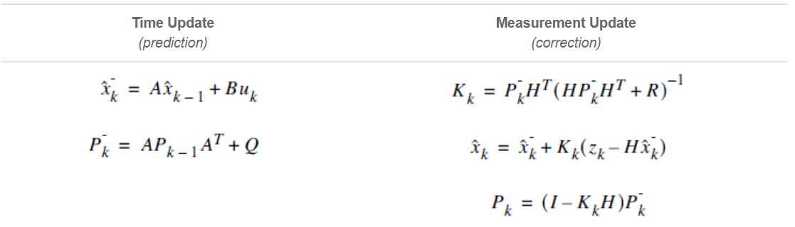
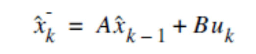
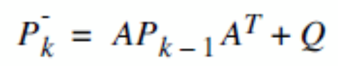
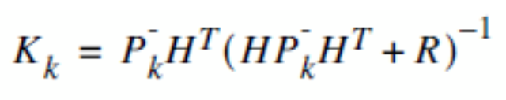
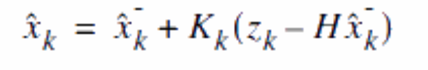
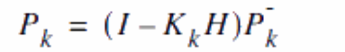

# Kalman Filter

## 1. Predict the state vector

## 2. Predict the error covariance

## 3. Compute the Kalman Gain K

## 4. Update the state vector X taking into consideration Zk

## 5. Update the error covariance
